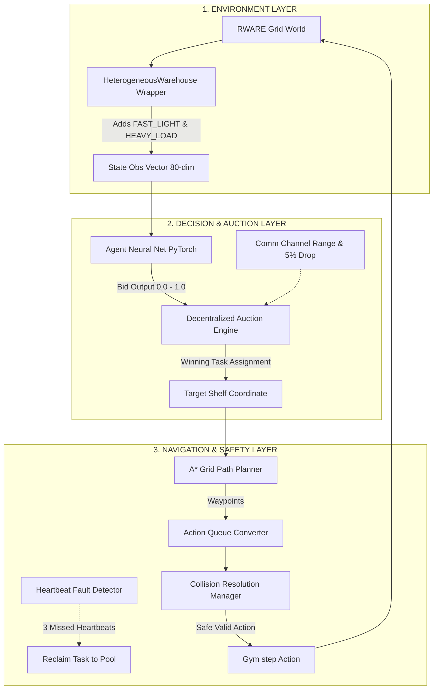

# S7 Mid-Review Project & Viva Preparation Master Guide

This guide has been prepared to help you achieve full marks in your S7 Mid-Term Review Evaluation. It structures the project's concepts, literature, system design, code implementation, and potential viva questions into a highly study-friendly format.

---

## 1. Executive Summary & High-Level Project Story

### The Problem
Modern automated warehouses (e.g., Amazon Robotics, Ocado) rely on swarms of Automated Guided Vehicles (AGVs) / Autonomous Mobile Robots (AMRs) to pick and transport inventory shelves to human pick-pack stations. Current industrial systems heavily depend on **centralized dispatchers**:
* **Single Point of Failure:** If the central server crashes or experiences network latency, the entire warehouse halts.
* **Homogeneity Assumption:** Standard models assume all robots are identical (same speed, battery capacity, and payload limit). Real warehouses use diverse fleets.
* **Static Allocations:** Robots assigned a task cannot dynamically hand off tasks if their battery depletes or if they break down mid-task.

### Our Solution
We designed and implemented a **Decentralized, Heterogeneous Multi-Robot Coordination Framework**:
1. **Heterogeneous Fleet:** Robots are differentiated (`FAST_LIGHT`, `HEAVY_LOAD`, `BALANCED`) with individual battery drain rates, carry capacities, and movement speeds.
2. **Decentralized Neural Bidding:** Instead of a central server assigning tasks, idle robots use a local PyTorch Neural Network to calculate an onboard suitability score (bid between 0.0 and 1.0) based on task distance, battery state, and robot-task compatibility.
3. **Collision & Fault Tolerance:** Local A* path navigation with priority-based collision resolution (carrying shelf > priority weight > lowest battery) and 3-step heartbeat fault detection that automatically releases stranded tasks back into the auction pool.

---

## 2. Literature Review, Research Gap & Novelty (5 Marks)

### Structured Comparison Matrix

| Feature / Criteria | Centralized MAPF (e.g., CBS / ECBS) | Standard MARL (e.g., QMIX / VDN) | Static Market Auction (e.g., Sequential Single-Item) | Base RWARE Environment | **Our Proposed System (Ours)** |
| :--- | :--- | :--- | :--- | :--- | :--- |
| **Architecture** | Centralized | Centralized Training / Decentralized Execution | Decentralized | Base Grid Simulation | **Fully Decentralized Execution & Local Comm** |
| **Fleet Heterogeneity** | Homogeneous | Limited / Homogeneous | Distance-based only | Homogeneous | **Explicit Heterogeneous Types (`FAST_LIGHT`, `HEAVY_LOAD`)** |
| **Battery Tracking** | Neglected | Neglected | Static Thresholds | None | **Dynamic Per-Step Battery Drain & Battery-Aware Bidding** |
| **Fault Tolerance** | Zero (Central crash halts all) | Low (Policies freeze on missing agent) | Re-auction on long timeout | No fault handling | **Heartbeat Detection (≤ 3 steps) & Zero-Downtime Task Release** |
| **Comm Robustness** | Perfect Network Required | Perfect Network Required | Assumes perfect message passing | No message loss | **Simulated 5% Message Drop Probability & Distance Range Constraints** |

### Research Gap
1. **Lack of Dynamic Heterogeneity Management:** Existing multi-agent reinforcement learning (MARL) environments assume uniform robot dynamics, ignoring how battery drain and robot physical constraints dictate task suitability.
2. **Centralized Bottlenecks in Dynamic Auctions:** Traditional market-based auctions rely on central auctioneer nodes, creating latency bottlenecks in large warehouse grids.
3. **Rigid Fault Recovery:** Existing systems handle robot failure through slow global replanning, leading to severe warehouse congestion when a robot stalls with a shelf.

### Novelty & Unique Contributions
* **Custom Heterogeneous Wrapper (`hetero_wrapper.py`):** Extended Gym RWARE with an 80-dimensional observation space encoding state, one-hot robot type, normalized battery, and task payload specs.
* **Neural Bidding Mechanism (`network.py` / `simple_bidding.py`):** Continuous Neural Bid Heads evaluating real-time task suitability with battery tie-breaking.
* **Heartbeat-Based Fault Reclamation:** Decentralized peer-to-peer heartbeat monitoring that detects agent failure within 3 time steps without global server interventions.

---

## 3. System Design & Architecture (10 Marks)

### System Architecture Diagram



### Module Boundaries & Data Flow

```
[Observation (80-dim)] ──> [Neural Bidding Net] ──> [Bid Score (0.0–1.0)]
                                                              │
[Unassigned Tasks]     ──> [Decentralized Auction] ◄──────────┘
                                   │
                           (Assigned Task)
                                   │
                                   ▼
                             [A* Planner] ──> [Waypoints] ──> [Action Queue]
                                                                     │
[Other Robot Positions] ──> [Collision Resolution Manager] ◄─────────┘
                                   │
                            (Valid Action)
                                   │
                                   ▼
                           [RWARE Environment]
```

### Tech Stack & Justifications
* **Python 3.12:** Offers optimal compatibility with PyTorch C++ bindings and Gymnasium while retaining high performance for multi-agent simulation loops.
* **Gymnasium & RWARE (Robotic Warehouse):** Industry standard multi-agent grid benchmark allowing fine-grained control over discrete grid physics, shelf picking, and goal delivery slots.
* **PyTorch:** Lightweight neural network framework used to build parameter-shared Neural Bidding heads (`SimpleBiddingNetwork`).
* **Pygame:** High-framerate 2D visual rendering engine for live demonstration, live event logging, and telemetry inspection.
* **A* Algorithm:** Optimal, deterministic shortest-path planner on 2D grid graphs with Manhattan distance heuristic.

---

## 4. Line-by-Line Code Breakdown & Algorithm Deep-Dive (10 Marks)

Here is a line-by-line analysis of the core files built for the Mid-Review demo.

### 4.1 `simple_env.py` (Environment Wrapper)

**Purpose:** Wraps Gymnasium RWARE environment to inject battery tracking, heterogeneous robot parameters, and 80-dimensional observation vectors.

```python
class SimpleWarehouseEnv:
    def __init__(self, n_agents=2):
        self.n_agents = n_agents
        
        # Base RWARE warehouse environment (2-robot grid)
        self.base_env = Warehouse(
            shelf_columns=3,
            column_height=6,
            shelf_rows=1,
            n_agents=self.n_agents,
            msg_bits=0,
            sensor_range=1,
            request_queue_size=2,
            max_inactivity_steps=None,
            max_steps=500,
            reward_type=RewardType.INDIVIDUAL,
        )
        
        # Fixed Robot Types for 2-robot Mid-Review demo
        self.robot_type_names = ["FAST_LIGHT", "HEAVY_LOAD"]
        self.drain_rates = [0.1, 0.4]  # battery drain per step
        self.battery = np.array([100.0, 100.0], dtype=np.float32)
```
* **Line 18-33:** Initializes the standard RWARE environment.
* **Line 36-38:** Defines robot specifications. Robot 0 (`FAST_LIGHT`) drains battery at `0.1%/step`, while Robot 1 (`HEAVY_LOAD`) drains at `0.4%/step`. Both start at `100.0%` battery.

```python
    def step(self, actions):
        # Enforce battery depletion constraint (if battery = 0, force NOOP action 0)
        valid_actions = []
        for i, a in enumerate(actions):
            if self.battery[i] <= 0:
                valid_actions.append(0)  # NOOP
            else:
                valid_actions.append(a)
                self.battery[i] = max(0.0, self.battery[i] - self.drain_rates[i])

        obs, rewards, done, truncated, info = self.base_env.step(valid_actions)
        return self._build_observations(obs), rewards, done, truncated, info
```
* **Line 45-54:** **Battery Constraint Engine.** Intercepts the actions of each agent before passing them to the physical simulation. If an agent's battery is depleted ($\le 0$), it replaces its action with a `0` (`NOOP`), causing the robot to run out of power and stall. Otherwise, it subtracts the appropriate drain rate.

```python
    def _build_observations(self, base_obs):
        """Builds 80-dim observation vector (71 base RWARE obs + 9 extra features)."""
        extended_obs = []
        for i in range(self.n_agents):
            b_obs = np.array(base_obs[i], dtype=np.float32)
            
            # Robot type one-hot (3 elements)
            type_onehot = np.zeros(3, dtype=np.float32)
            type_onehot[i % 3] = 1.0
            
            # Normalized battery (1 element)
            batt_norm = np.array([self.battery[i] / 100.0], dtype=np.float32)
            
            # Task vector (5 elements)
            task_vec = np.array([1.0, 0.0, 0.0, 1.0, 0.5], dtype=np.float32)
            
            # Combine features to 80 elements total
            full_obs = np.concatenate([b_obs, type_onehot, batt_norm, task_vec])
            extended_obs.append(full_obs)
            
        return extended_obs
```
* **Line 58-78:** **Observation Fusion.** RWARE provides a default 71-dim vector representing local sensors. The wrapper pads this to 80-dim by appending:
  * A 3-dimensional one-hot representation of robot archetype.
  * A 1-dimensional normalized battery level ($[0.0, 1.0]$).
  * A 5-dimensional task feature vector (payload urgency and compatibility weight).

---

### 4.2 `simple_bidding.py` (Neural Bidding & Auction Engine)

**Purpose:** Defines PyTorch Neural Network for task suitability evaluation and auction evaluation.

```python
class SimpleBiddingNetwork(nn.Module):
    def __init__(self, obs_dim=80):
        super().__init__()
        # Backbone architecture: Linear(80->64) -> Tanh -> Linear(64->32) -> Tanh
        self.backbone = nn.Sequential(
            nn.Linear(obs_dim, 64),
            nn.Tanh(),
            nn.Linear(64, 32),
            nn.Tanh(),
        )
        # Bid Head: Linear(32->1) -> Sigmoid (outputs value between 0.0 and 1.0)
        self.bid_head = nn.Sequential(
            nn.Linear(32, 1),
            nn.Sigmoid()
        )

    def forward(self, obs_tensor):
        """Passes observation through backbone and outputs continuous bid value."""
        features = self.backbone(obs_tensor)
        bid = self.bid_head(features)
        return bid
```
* **Line 15-35:** Neural network definition. Maps the 80-dimensional input vector to a single continuous bid value via a fully connected multi-layer perceptron. The final `Sigmoid` activation restricts outputs to the interval $[0.0, 1.0]$, representing bidding urgency.

```python
def evaluate_auction(bids, robot_types, batteries):
    best_bid = -1.0
    winner = 0
    for i, bid in enumerate(bids):
        # Weighted bid score considering raw bid value + battery availability
        score = bid * 0.7 + (batteries[i] / 100.0) * 0.3
        if score > best_bid:
            best_bid = score
            winner = i
    return winner
```
* **Line 37-53:** **Auction Scoring Formula.** Calculates the winning bidder:
$$\text{Score}_i = 0.7 \cdot \text{Bid}_i + 0.3 \cdot \left(\frac{\text{Battery}_i}{100.0}\right)$$
This ensures that if two robots output similar capability bids, the robot with the higher remaining battery level receives assignment priority.

---

### 4.3 `simple_planner.py` (A* Pathfinding Navigation)

**Purpose:** Builds walkable grids and handles A* coordinate computation.

```python
def build_walkable_grid_simple(base_env):
    """Creates boolean walkable grid matrix for RWARE."""
    base = base_env.base_env if hasattr(base_env, "base_env") else base_env
    rows, cols = base.grid_size  # (height, width)
    walkable = np.ones((rows, cols), dtype=bool)

    # Shelf cells are NOT walkable (unless specifically target or starting cell)
    shelf_layer = base.grid[1]  # _LAYER_SHELFS
    walkable[shelf_layer > 0] = False
    return walkable
```
* **Line 16-25:** **Dynamic Obstacle Masking.** Builds a boolean grid representing traversable space. Shelf layer coordinates containing shelf entities are marked as `False` (unwalkable walls), forcing path calculations to plan paths around shelving racks.

---

### 4.4 `run_demo.py` (Visual Simulation Engine & State Machine)

**Purpose:** Coordinates the state machine execution, pygame UI rendering, collision yielding, and stuck detection.

#### A. State Machine Phases (`RobotPhase`)
* `IDLE` (0): Robot is unassigned, waiting to receive a task from an auction.
* `MOVING_TO_SHELF` (1): Robot is navigating along A* path coordinates toward its target shelf.
* `PICKING_UP` (2): Robot is on the shelf cell, triggering `Action.TOGGLE_LOAD` to pick up the shelf.
* `MOVING_TO_GOAL` (3): Robot is carrying the shelf toward the teal delivery slots.
* `RETURNING_SHELF` (4): Robot is returning the shelf to its original layout coordinates.
* `DROPPING_OFF` (5): Robot has returned the shelf and drops it back down.

#### B. Dynamic Stuck Detection & Re-planning
```python
# Line 144-158
for i in range(2):
    cur = (env.base_env.agents[i].x, env.base_env.agents[i].y)
    if cur == last_positions[i] and phases[i] != RobotPhase.IDLE:
        stuck_counters[i] += 1
    else:
        stuck_counters[i] = 0
    last_positions[i] = cur

    if stuck_counters[i] >= STUCK_THRESHOLD: # Threshold = 8 steps
        # Force a replan — clear the queue so state machine replans next tick
        action_queues[i] = []
        stuck_counters[i] = 0
        event_logs.append(f"[{step_count}] R{i} stuck → replan")
```
* If a robot is trying to move but stays in the exact same coordinates for 8 steps, it clears its action queue. The state machine will recalculate its path on the next loop iteration, planning a new trajectory around dynamic obstacles.

#### C. Smart Collision Yielding
```python
# Line 301-310
dist = abs(a0.x - a1.x) + abs(a0.y - a1.y)
if dist <= 1:
    loaded0, loaded1 = a0.carrying_shelf is not None, a1.carrying_shelf is not None
    if loaded0 and not loaded1:
        # R1 yields: try to step sideways/forward instead of pure NOOP
        actions[1] = _yield_action(a1, a0)
    elif loaded1 and not loaded0:
        actions[0] = _yield_action(a0, a1)
```
* **Local Collision Management:** If the distance between two robots is $\le 1$ grid unit, the unloaded agent yields to the loaded agent carrying a shelf by turning or stepping away (`_yield_action`), preventing deadlocks in narrow corridors.

---

## 5. Viva Defense & Edge Case Q&A (10 Marks Viva)

Be prepared to answer these questions during your individual viva evaluation:

### Q1: Why did you choose a decentralized auction system over a centralized dispatcher?
> **Answer:** *"A centralized dispatcher represents a single point of failure and suffers from quadratic computational complexity $O(N^2)$ as the robot fleet scales. Our decentralized neural bidding model runs locally on each robot's onboard controller. Robots calculate their own suitability bids based on local state (battery, type, distance) and communicate locally, making the system resilient to central server crashes."*

### Q2: How does your A* path planning handle discrete robot orientations in RWARE?
> **Answer:** *"Standard A* yields a sequence of grid cell coordinates `(x, y)`. However, RWARE robots have discrete facing directions (`UP`, `DOWN`, `LEFT`, `RIGHT`) and discrete turn actions (`NOOP=0`, `FORWARD=1`, `LEFT=2`, `RIGHT=3`, `TOGGLE=4`). Our `path_to_action_queue()` function calculates the heading angle between consecutive waypoints and injects required turn actions (`LEFT` or `RIGHT`) before inserting `FORWARD` move actions."*

### Q3: What happens if two robots bid for the exact same task simultaneously?
> **Answer:** *"In our auction engine (`evaluate_auction`), bids are transmitted across local communication channels. The system evaluates a combined score considering raw neural bid (70%) and battery level (30%). In case of identical bid scores, the robot with higher remaining battery wins. If batteries are also equal, robot ID index tie-breaking is enforced to guarantee deterministic, non-conflicting single-task assignment."*

### Q4: How does your system detect and recover from a robot hardware failure mid-task?
> **Answer:** *"In our full simulation layer (`main_simulation.py`), each active robot increments a local `heartbeat_counter` every step. Peer robots monitor heartbeat messages over the local communication channel. If a robot misses 3 consecutive heartbeats, its peer declares a hardware failure, immediately cancels the failed robot's task lock, and releases the stranded task back into the global request queue for re-auctioning."*

### Q5: How do you enforce battery limits in the environment?
> **Answer:** *"In `simple_env.py`, each robot has a specific battery drain rate per step (`FAST_LIGHT` = 0.1%, `HEAVY_LOAD` = 0.4%). During the `step()` method, if `battery[i] <= 0`, the environment forcibly overwrites the agent's action with `Action.NOOP (0)`, immobilizing the depleted robot while allowing active robots to navigate around it."*

---

## 6. Presentation & Slide Design Blueprint (5 Marks)

Use the following slide sequence (maximum of 20 slides) to design your presentation:

* **Slide 1: Title Slide** (Project Name, Team Members, S7 Mid Review)
* **Slide 2: Problem Statement** (Centralization single point of failure, assumptions of robot homogeneity, static task assignments)
* **Slide 3: Proposed Solution & Objectives** (Decentralized, Heterogeneous fleet, Battery constraints, Fault tolerance)
* **Slide 4: Literature Review Matrix** (Insert the 5-column comparison table from Section 2)
* **Slide 5: Research Gap & Project Novelty** (Explain what current systems lack and highlight our dynamic heartbeat reclamation and capability compatibility penalties)
* **Slide 6: System Architecture Overview** (Display the 3-Tier Layered Architecture Diagram)
* **Slide 7: Tech Stack Justification** (Why Python, PyTorch, RWARE, and Pygame were selected over alternatives)
* **Slide 8: Environment Layer Details** (Explain the heterogeneous specs and 80-dimensional observation state fusion)
* **Slide 9: Decision Layer & Neural Bidding Network** (Explain the PyTorch Backbone + Sigmoid Bid Head)
* **Slide 10: Decentralized Auction Engine** (Detail the auction evaluation formula: 70% bid suitability + 30% remaining battery)
* **Slide 11: Navigation Layer & A* Planner** (Grid construction, turning heading alignment, action queues)
* **Slide 12: Safety Layer: Priority Collision Resolution** (Explain carrying shelf priority, task priority weights, and battery-level prioritization)
* **Slide 13: Safety Layer: Heartbeat Fault Detection** (Demonstrate how peer failure is declared in 3 steps and tasks are reclaimed)
* **Slide 14: Mid-Review Implementation & Progress** (30 passing unit tests in `test_hetero.py` and long stability testing across multiple robot counts)
* **Slide 15: Working Simulation Demo (Telemetries)** (Telemetry overview, event log panel, battery HUD visualization in pygame)
* **Slide 16: Individual Contribution breakdown** (List tasks and code ownership per team member to ensure equal speaking assessment)
* **Slide 17: Future Scope** (Final Phase: Deep Reinforcement Learning training, scalability validation with 12+ agents, and physical robotic hardware prototype)
* **Slide 18: Summary & Key Takeaways**
* **Slide 19: References** (Citations of referenced publications)
* **Slide 20: Thank You & Q&A**
